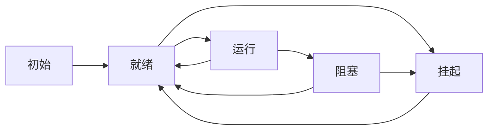

# FreeRTOS的API

###1. 任务

**常见Task API:**

|Task API|功能|函数说明|
|---|---|---|
|xTaskCreate|创建一个任务|在FreeRTOS入门.pdf中有详细说明|
|vTaskStartScheduler|启动调度器|开始调度初始化的任务|
|vTaskDelay|阻塞延迟|任务主动进入阻塞态，从函数调用开始，延迟固定时间|
|vTaskDelayUntil|阻塞延迟|任务主动进入阻塞态，延迟到某一确定时刻|
|xTaskGetTickCount|获得当前心跳值|获取时间，和vTaskDelayUntil搭配使用|
代码所在位置：source/task.c

**任务状态：**
|状态|描述|
|--|--|
|执行|不解释|
|就绪|等待被调度|
|阻塞|对于调度器不可见，等待某事件完成，否则不能就绪|
|挂起|对于调度器不可见，只能使用程序主动恢复|

**阻塞：**
可以用来实现阻塞延迟，而不是死循环占据调度资源
（高优先级的死循环会导致低优先级的任务饿死）

**空闲任务：**
任务不能都处于阻塞状态。该状态下所有的任务都不可运行,所以也不能被调度器选中。
当调用 vTaskStartScheduler()时,调度器会自动创建一个空闲任务

**状态切换图：**

###2. 队列
