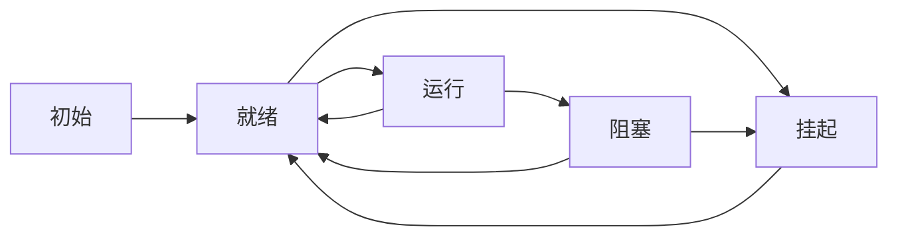

# FreeRTOS的API

## 1. 任务

**任务状态:**
|状态|描述|
|--|--|
|执行|不解释|
|就绪|等待被调度|
|阻塞|对于调度器不可见，等待某事件完成，否则不能就绪|
|挂起|对于调度器不可见，只能使用程序主动恢复|

**阻塞:**

可以用来实现阻塞延迟，而不是死循环占据调度资源
（高优先级的死循环会导致低优先级的任务饿死）

**空闲任务:**

任务不能都处于阻塞状态。该状态下所有的任务都不可运行,也不能被调度器选中(CPU不能空闲)。
当调用 vTaskStartScheduler时,调度器会自动创建一个空闲任务。
空闲任务是最低优先级，不会对其他任务进行干扰。
一旦高优先级任务进入就绪状态，空闲任务就会立即退出运行。

**空闲任务钩子函数:**

空闲任务每循环一次，就自动调用一次

功能：
1. 低优先级或者后台需要不停执行的代码
2. 测试系统的处理裕量（查看处理器有多少富余的处理时间）
3. 将处理器配置到低功耗的模式

实现限制：
1. 不能阻塞或者挂起
2. 如果vTaskDelete函数被使用，空闲钩子函数需要尽快返回。
如果空闲任务一直在钩子函数中，则无法进行资源回收。

钩子函数原型：void vApplicationIdleHook(void)

**状态切换图:**

**删除:**

使用vTaskDelete函数删除任务。
需要注意：需要提供给空闲任务一定的执行时间，用来回收内存。

**调度算法:**

优先级抢占式调度：总是高优先级的任务得到执行。优先级的选择需要考虑。

**常见Task API:**

|Task API|功能|函数说明|
|---|---|---|
|xTaskCreate|创建一个任务|在FreeRTOS入门.pdf中有详细说明|
|vTaskStartScheduler|启动调度器|开始调度初始化的任务|
|vTaskDelay|阻塞延迟|任务主动进入阻塞态，从函数调用开始，延迟固定时间|
|vTaskDelayUntil|阻塞延迟|任务主动进入阻塞态，延迟到某一确定时刻|
|xTaskGetTickCount|获得当前心跳值|获取时间，和vTaskDelayUntil搭配使用|
|vTaskPrioritySet|改变优先级|在调度器启动后改变任务的优先级|
|uxTaskPriorityGet|获取优先级|获取指定任务的优先级|
|vApplicationIdleHook|钩子函数|钩子函数的原型|
|vTaskDelete|删除任务|删除自己或者其他任务|

代码所在位置：source/task.c